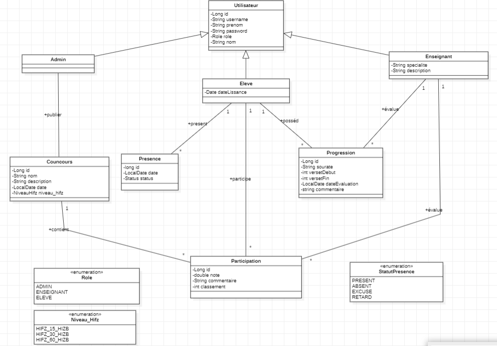
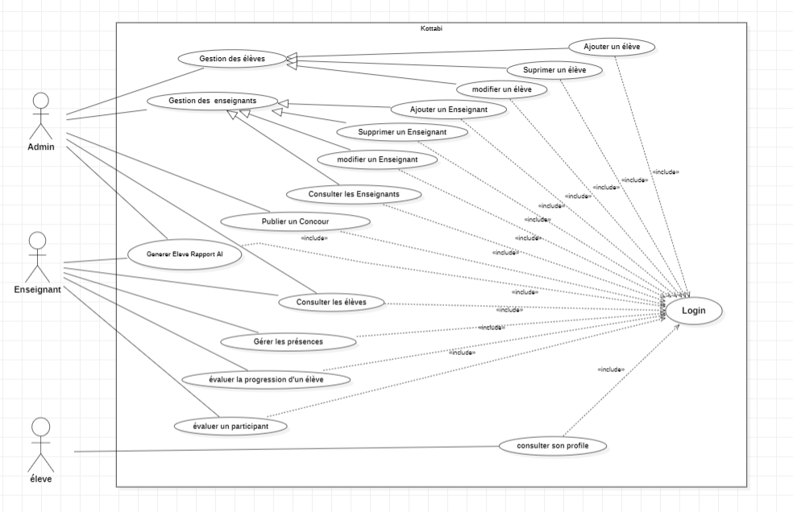
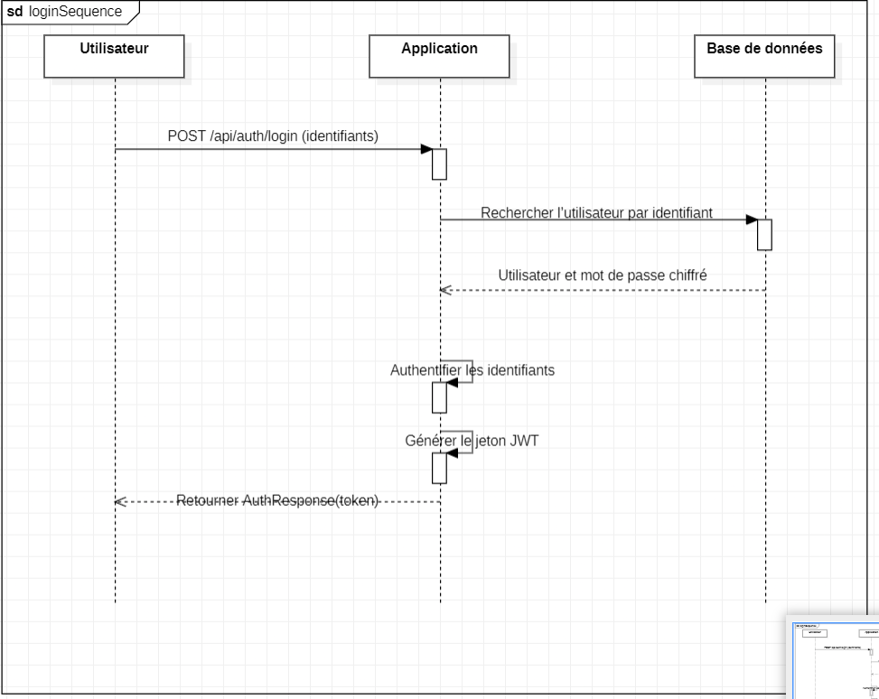
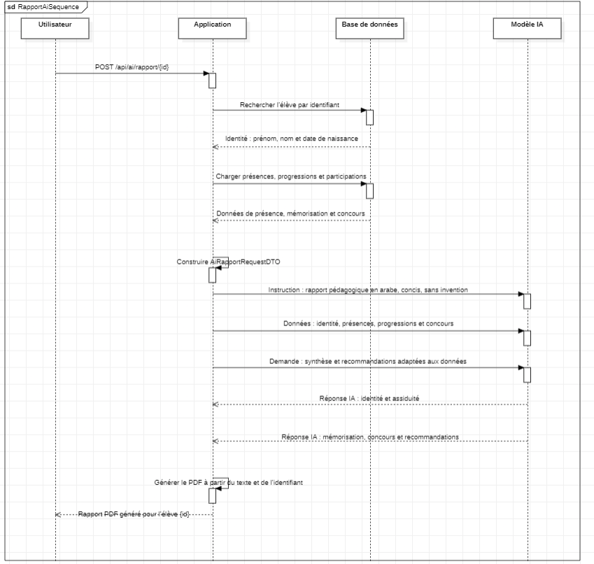
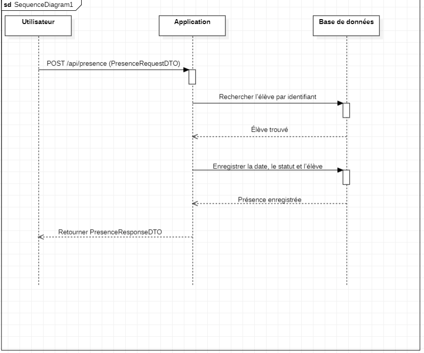
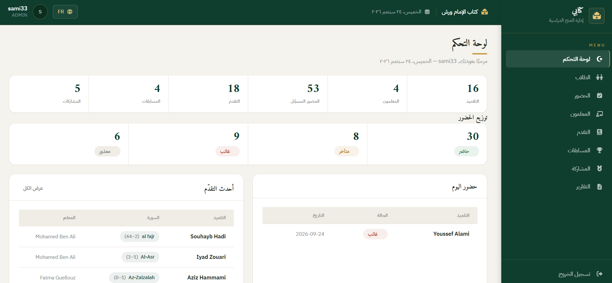

# Kottabi — Quranic School Management Backend

Kottabi is a Spring Boot REST API for managing a Quranic school (*Kottab*).  
It provides tools for student and teacher management, attendance, Quran memorization progress, competitions, authentication, AI-generated reports, and Arabic PDF export.

## Features

- JWT authentication and role-based authorization
- Roles: `ADMIN`, `ENSEIGNANT`, `ELEVE`
- Student and teacher management
- Attendance tracking
- Quran memorization progress
- Competition and participation management
- AI-generated pedagogical reports
- Arabic PDF export
- Redis caching
- Email support for generated credentials
- Swagger / OpenAPI documentation
- Docker support

## Tech Stack

- **Language:** Java 21
- **Framework:** Spring Boot 4.1
- **Security:** Spring Security + JWT
- **Database:** MySQL 8
- **ORM:** Spring Data JPA / Hibernate
- **Migrations:** Flyway
- **Cache:** Redis
- **Mapping:** MapStruct
- **AI:** Spring AI + Google GenAI / Ollama
- **PDF:** Apache PDFBox + ICU4J
- **Mail:** Spring Mail
- **Testing:** JUnit + Mockito
- **Documentation:** Swagger / OpenAPI
- **Containerization:** Docker / Docker Compose

## Quick Start

### Prerequisites

Make sure you have:

- Java 21
- MySQL 8
- Redis
- Maven or Maven Wrapper
- Google GenAI API key if AI reports are enabled
- SMTP credentials if email sending is enabled

### 1. Clone the Repository

```bash
git clone https://github.com/Souhayb120/Kottabi_Kottab_Management_System_BackEnd.git
cd Kottabi_Kottab_Management_System_BackEnd
```

### 2. Configure Environment Variables

Create the required environment variables:

```env
SPRING_DATABASE_URL=jdbc:mysql://localhost:3306/kottabi
SPRING_DATASOURCE_USERNAME=root
SPRING_DATASOURCE_PASSWORD=

JWT_SECRET=your_secure_secret

REDIS_HOST=localhost
REDIS_PORT=6379

CHAT_MODEL=google-genai
GEMINI_API_KEY=your_api_key
CHAT_MODEL_VERSION=your_model_name

MAIL_HOST=smtp.gmail.com
SPRING_EMAIL=your_email@example.com
SPRING_EMAIL_PASSWORD=your_app_password
```

> Do not commit real API keys, passwords, or JWT secrets.

### 3. Run the Application

Windows:

```powershell
.\mvnw.cmd spring-boot:run
```

Linux / macOS:

```bash
./mvnw spring-boot:run
```

The backend runs by default on:

```text
http://localhost:8080
```

## Docker

Run the backend, MySQL, and Redis together:

```bash
docker compose up --build
```

Current ports:

| Service | Port |
|---|---|
| Backend | `8081` |
| MySQL | `3308` |
| Redis | `6379` |

Backend URL with Docker:

```text
http://localhost:8081
```

Stop the containers:

```bash
docker compose down
```

## Repository Structure

```text
src/main/java/com/example/kottabi
├── config          # Security and application configuration
├── controller      # REST controllers
├── DTO             # Request and response DTOs
├── models          # JPA entities and enums
├── repositories    # Spring Data repositories
└── services        # Business logic
```

## Architecture Overview

Kottabi follows a layered backend architecture:

```text
Client
  ↓
Controller
  ↓
Service
  ↓
Repository
  ↓
MySQL
```

Redis is used for caching, while AI and PDF services handle report generation and export.

## Main API Endpoints

| Resource | Base Path |
|---|---|
| Authentication | `/api/auth` |
| Students | `/api/eleve` |
| Teachers | `/api/enseignant` |
| Attendance | `/api/presence` |
| Progress | `/api/progressions` |
| Competitions | `/api/concour` |
| Participations | `/api/participation` |
| AI Reports | `/api/ai/rapport` |

### Example: Login

```http
POST /api/auth/login
```

Protected routes require:

```http
Authorization: Bearer <token>
```

### Registration

A registration endpoint exists on the backend:

```http
POST /api/auth/register
```

It is intentionally **not exposed in the frontend**.

Public registration could allow unauthorized users to create privileged accounts such as `ADMIN`, so account creation remains controlled from the backend/admin side.

### Example: Generate AI Report

```http
POST /api/ai/rapport/{studentId}
```

Download the generated PDF:

```http
GET /api/ai/rapport/{studentId}/file
```

The report is generated in Arabic using student attendance, memorization progress, and competition data.

## Project Visuals

### Class Diagram



### Use Case Diagram



### Login Sequence Diagram



### AI Report Generation Sequence Diagram



### Attendance Registration Sequence Diagram



### Application Screenshots

#### Dashboard



## API Documentation

Swagger UI:

Local:

```text
http://localhost:8080/swagger-ui/index.html
```

Docker:

```text
http://localhost:8081/swagger-ui/index.html
```

## Testing

Run tests:

```bash
./mvnw test
```

Build the project:

```bash
./mvnw clean package
```

## Security

Kottabi uses:

- Stateless JWT authentication
- BCrypt password hashing
- `@PreAuthorize` for role-based authorization
- Ownership checks for protected user data
- Environment variables for secrets

For production, use HTTPS and restrict CORS to trusted origins.

## Contributing

If you want to contribute:

1. Fork the repository
2. Create a feature branch
3. Make your changes
4. Run the tests
5. Open a pull request

## Author

**Souhayb Hadi**  
Full-Stack Developer — Java / Spring Boot / React

GitHub: [Souhayb120](https://github.com/Souhayb120)
FrontEnd [Front_End_Repository](Repo : https://github.com/Souhayb120/Kottabi_Kottab_Management_System_FrontEnd)

## License

This project is currently intended for educational and portfolio purposes.
